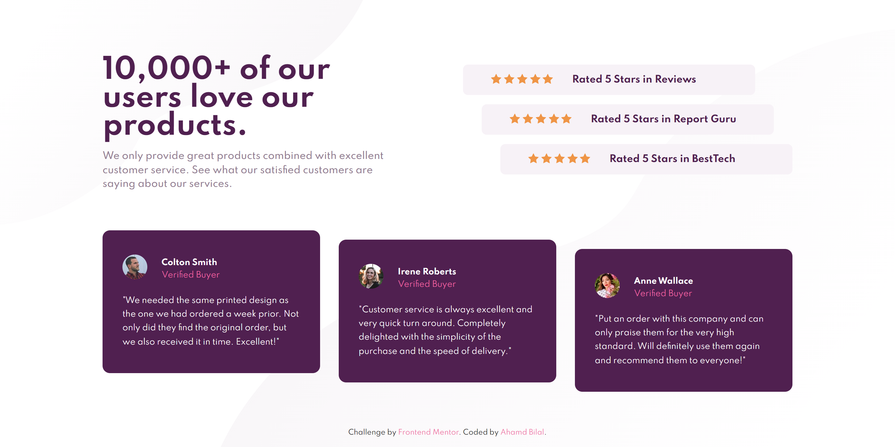

# Frontend Mentor - Social proof section solution

This is a solution to the [Social proof section challenge on Frontend Mentor](https://www.frontendmentor.io/challenges/social-proof-section-6e0qTv_bA). Frontend Mentor challenges help you improve your coding skills by building realistic projects. 

## Table of contents

- [Overview](#overview)
  - [The challenge](#the-challenge)
  - [Screenshot](#screenshot)
  - [Links](#links)
- [My process](#my-process)
  - [Built with](#built-with)
  - [What I learned](#what-i-learned)
  - [Useful resources](#useful-resources)
- [Author](#author)

## Overview

### The challenge

Users should be able to:

- View the optimal layout for the section depending on their device's screen size

### Screenshot

### Links

- Solution URL: [https://www.frontendmentor.io/solutions/html-css-zSNfIQtJB](https://www.frontendmentor.io/solutions/html-css-zSNfIQtJB)
- Live Site URL: [https://ahmadbilalse.github.io/social-proof-section-master/](https://ahmadbilalse.github.io/social-proof-section-master/)

## My process

### Built with

- HTML5 markup
- CSS custom properties
- CSS Grid
- Flexbox
- Mobile-first workflow

### What I learned

Got a better understanding on :nth-child() pseudo-class.

### Useful resources

- [https://developer.mozilla.org/en-US/docs/Web/CSS/:nth-child](https://developer.mozilla.org/en-US/docs/Web/CSS/:nth-child) - Documentation on :nth-child() pseudo-class.

## Author

- Frontend Mentor - [@ahmadbilalse](https://www.frontendmentor.io/profile/ahmadbilalse)